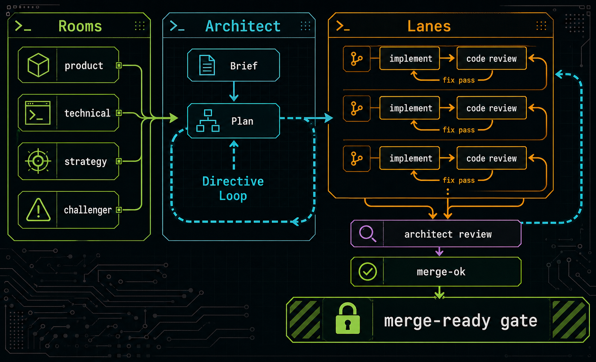

# x

`x` is a Codex architect-to-code workflow. It helps a user turn direction into an accepted architecture, split execution into gated lanes, review implementation evidence, integrate approved work, and stop with a merge-back recommendation instead of an implicit merge.

## Use

Use `x` from Codex in the product repo you want to work on:

```text
$x                         show the root-facing command menu
$x architect[: <goal>]     start or continue architect-to-code work
$x status                  show current x state
$x resume                  resume the current run
$x checkpoint              write a progress checkpoint
$x close                   close with gates and recommendation

$x discussion: <topic>     discuss direction before architecture
$x council: <topic>        synthesize multiple role views
$x company-council: <topic> founder/cto/product-lead/growth/challenger room
$x with <role>: <question> ask one configured role
$x product: <question>     discuss product shape and user path
$x technical: <question>   discuss technical boundary and risk
$x strategy: <question>    discuss priority, sequencing, and stop conditions
$x challenger: <question>  challenge assumptions
```

Users talk to `$x`. The bundled `x_state.py` script is internal plumbing for recording markdown state, creating packages, and running gates; users should not need to memorize its command list.

## What x Does

`x` keeps architecture, execution, review, and close decisions explicit:

- Turns product, technical, strategy, founder, CTO, product-lead, growth, challenger, council, or architect discussion into durable direction.
- Records root decisions before treating discussion output as accepted work.
- Converts accepted direction into an Architecture Brief, Technical Contract, and Architect Execution Plan.
- Splits implementation into lane worktrees with scoped ownership and verification expectations.
- Requires reviewer evidence and architect `merge-ok` before integration.
- Runs merge-ready checks and reports a merge-back recommendation. It does not merge, push, open PRs, or call GitHub unless root explicitly asks.

## How The Loop Works



_Rooms shape direction; lanes run implementation, code review, and fix-pass loops; architect directives and `merge-ok` control the path to the merge-ready gate._

Direction work happens before architecture when root wants to shape or challenge a direction. The visible room keeps role identity clear, for example product, technical, strategy, founder, CTO, product-lead, growth, challenger, architect, and main. Room output is summarized as `Room Essence` so main can later draft a BRD, PRD, strategy document, sales strategy, or architect intake from the same advisory source.

The architect room turns accepted direction into execution boundaries. After root accepts the Architecture Brief, `x` materializes an integration worktree and requires a gated Architect Execution Plan before any lane work starts.

Execution happens in lanes. Engineers make bounded implementation or fix passes in lane worktrees, reviewers inspect the resulting evidence, and the architect decides whether each lane is fit to integrate. Integration remains serial even when lane work and reviews run in parallel.

Close is a gate, not a feeling. `x` checks planned lanes, reviews, architect approvals, integration status, risks, and final verification before recommending merge-back.

## Core Concepts

- **Rooms:** Visible root-facing conversations with named participants. Discussion output is advisory until root records a decision, and final synthesis is captured as `Room Essence`.
- **Architect:** Owns execution shape, technical boundaries, directives, and merge review.
- **Lanes:** Isolated implementation scopes that can run in parallel when the plan and dependencies allow it.
- **Gates:** Simple checkable transitions that prevent premature lane work, integration, and close.
- **Markdown state:** Durable state lives outside product repos under `~/.x/projects/<project-key>/`.

## Install

From this checkout:

```bash
scripts/install-local.sh
```

The installer links the local checkout into Codex:

- `~/.codex/skills/x -> <this-checkout>/skill`
- `~/.codex/agents/architect.toml -> <this-checkout>/agents/architect.toml`
- `~/.codex/agents/engineer.toml -> <this-checkout>/agents/engineer.toml`
- `~/.codex/agents/reviewer.toml -> <this-checkout>/agents/reviewer.toml`

Restart Codex if it does not discover the installed skill or agents.

## State And Project Binding

Project-specific context stays in the product repo:

```text
PROJECT_CONSTRAINTS.md
AGENTS.md
.x/project/profile.md
```

Runtime state stays outside product repos:

```text
~/.x/projects/<project-key>/
```

By default, `x` uses the git repository name as the project key. For git worktrees, it resolves the main repository name instead of the worktree directory name.

Override the project key or runtime root when needed:

```bash
X_PROJECT_KEY=my-project python ~/.codex/skills/x/scripts/x_state.py status
X_HOME=/tmp/x-runtime python ~/.codex/skills/x/scripts/x_state.py status
```

## Internal Tools

The state helper is available at:

```bash
python ~/.codex/skills/x/scripts/x_state.py --help
```

Common internal checks:

```bash
python ~/.codex/skills/x/scripts/x_state.py doctor
python ~/.codex/skills/x/scripts/x_state.py status
python ~/.codex/skills/x/scripts/x_state.py audit --run-id <run-id>
python ~/.codex/skills/x/scripts/x_state.py cleanup-worktrees --run-id <run-id>
python ~/.codex/skills/x/scripts/x_state.py cleanup-worktrees --run-id <run-id> --apply
```

- `doctor` reports project binding and install diagnostics.
- `status` reports the current project and run state.
- `audit` produces a read-only run report unless `--write` is passed.
- `cleanup-worktrees` removes only clean, integrated, registered lane worktrees when `--apply` is passed.
- `package --role reviewer --reviewer-backend codex-native` runs native `codex review` from the lane worktree and records the resulting review without embedding the full raw diff in a package.

Most other `x_state.py` commands are workflow internals used by the `$x` skill to record interactions, briefs, plans, packages, reviews, directives, decisions, risks, gates, and close records.

## Repository Layout

- `skill/`: Codex skill, state helper scripts, templates, and workflow references.
- `agents/`: generic `architect`, `engineer`, and `reviewer` agent prompts.
- `scripts/`: local install helpers.

Runtime state does not belong in this repo.

## References

- [`skill/SKILL.md`](skill/SKILL.md)
- [`skill/references/architect-room-workflow.md`](skill/references/architect-room-workflow.md)
- [`skill/references/engineering-loop-principles.md`](skill/references/engineering-loop-principles.md)
- [`skill/references/gates-and-close-policy.md`](skill/references/gates-and-close-policy.md)
- [`skill/references/parallel-execution-policy.md`](skill/references/parallel-execution-policy.md)
- [`skill/references/root-interaction-design.md`](skill/references/root-interaction-design.md)
